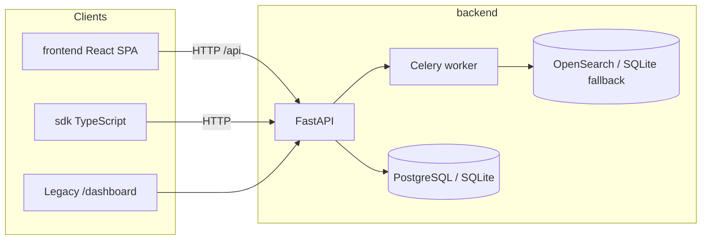

# Architecture

## Overview

CredenceAI is a search-intelligence platform with three deployable packages and shared documentation:

## Package responsibilities

| Package | Role |
|---------|------|
| `backend/` | REST API, auth, job orchestration, crawling pipeline, legacy ops HTML dashboard |
| `frontend/` | User-facing React SPA (marketing, auth, search, monitors, collections, billing) |
| `sdk/` | Typed HTTP client (`@credenceai/sdk`) for jobs, search, auth, monitors, collections |
| `docs/` | Operational runbooks and API reference |

## Request flow (search job)

1. Client submits `POST /api/jobs` with query/input.
2. FastAPI validates auth (JWT Bearer or API key), classifies intent, persists job.
3. Celery worker fetches sources via adapters (SearXNG, Wikidata, etc.).
4. Results are normalized, scored, deduplicated, and indexed.
5. Client polls `GET /api/jobs/{id}` or queries `GET /api/search`.

## Backend internal layout

| Path | Maps to |
|------|---------|
| `backend/src/app/api/` | HTTP routes |
| `backend/src/app/services/` | Business logic |
| `backend/src/app/middleware/` | API key auth |
| `backend/src/app/agents/` | Agentic planning and quality layers |
| `backend/migrations/` | Alembic schema migrations |

## Deployment model

**Split deploy (default):** Backend serves JSON API only. Frontend is a static nginx container. Configure `CORS_ALLOWED_ORIGINS` and `VITE_API_BASE_URL` accordingly.

## Historical specs

Product requirement documents from earlier iterations live in `docs/archive/specs/`.
