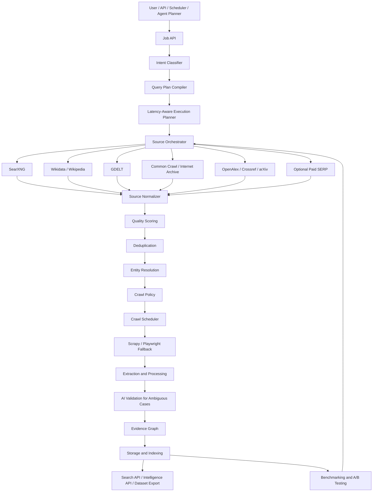

# High-Level Architecture

## Architecture Summary

CredenceAI is organized into five major layers:

1. Interfaces and control.
2. Discovery and source layer.
3. Data processing, trust, and crawling layer.
4. Storage, indexing, and knowledge plane.
5. Monitoring, benchmarking, and improvement loop.

## High-Level Flow

## Layer 1: Interfaces and Control

| Component | Responsibility |
|---|---|
| Web UI | Submit jobs, search, review results, inspect intelligence cards. |
| REST/GraphQL API | Programmatic job submission and retrieval. |
| CLI/SDK | Developer and data workflow access. |
| Scheduler | Recurring monitoring and refresh jobs. |
| Webhooks | Integration with alerting and downstream workflows. |
| Job API | Validation, lifecycle, priority, queueing, trace ID. |

## Layer 2: Discovery and Source Layer

| Source | Primary use |
|---|---|
| SearXNG | Free-first general web search. |
| Wikidata/Wikipedia | Entity identity, aliases, background context. |
| GDELT | News/event discovery. |
| Common Crawl | Historical or low-freshness content. |
| Internet Archive | Historical page evidence. |
| OpenAlex/Crossref/arXiv | Scholarly and research intelligence. |
| OpenStreetMap/Nominatim | Location and geospatial identity. |
| Paid SERP APIs | Optional fallback when benchmarks justify it. |

## Layer 3: Trust and Processing Layer

This layer decides what should be trusted.

| Component | Purpose |
|---|---|
| Source Normalizer | Convert every source response into common schemas. |
| Quality Scoring | Score relevance, freshness, reliability, authority, extraction likelihood, and risk. |
| Deduplication | Remove duplicated URLs, documents, media, entities, and search results. |
| Entity Resolution | Link mentions to canonical entities. |
| Crawl Policy | Decide whether crawling is allowed and safe. |
| Extraction | Convert raw pages and files into clean text and metadata. |
| AI Validation | Validate ambiguous, borderline, or high-value cases. |

## Layer 4: Storage and Indexing

| Store | Purpose |
|---|---|
| Postgres | Jobs, metadata, scores, entities, decisions, audit records. |
| MinIO/S3 | Raw payloads, HTML, binaries, extracted files, archives. |
| OpenSearch | Full-text, BM25, hybrid, and vector-capable search index. |
| Redis | Cache, queue support, canonical URL cache, robots cache, entity cache. |
| Kafka | Event bus for scalable asynchronous processing. |
| Graph/Entity Store | Entity relationships, aliases, provenance graph. |
| Analytics Store | Metrics, benchmark results, trends, experiment data. |

## Layer 5: Monitoring, Benchmarking, and Improvement

| Component | Purpose |
|---|---|
| Observability | Metrics, logs, traces, dashboards. |
| Benchmark Runner | Evaluate quality and performance on labeled datasets. |
| A/B Testing | Compare source strategies, scoring models, crawlers, and agents. |
| Admin Review | Resolve ambiguous entities, conflicts, and low-confidence items. |
| Agent Feedback Loop | Improve routing, scoring, extraction, and summaries. |

## Architectural Principles

1. Store raw data, but do not trust it automatically.
2. Scoring and deduplication should happen before expensive work.
3. Crawl policy must be deterministic and auditable.
4. AI agents should assist with judgment, not govern safety.
5. Benchmark data decides whether a change is an improvement.
