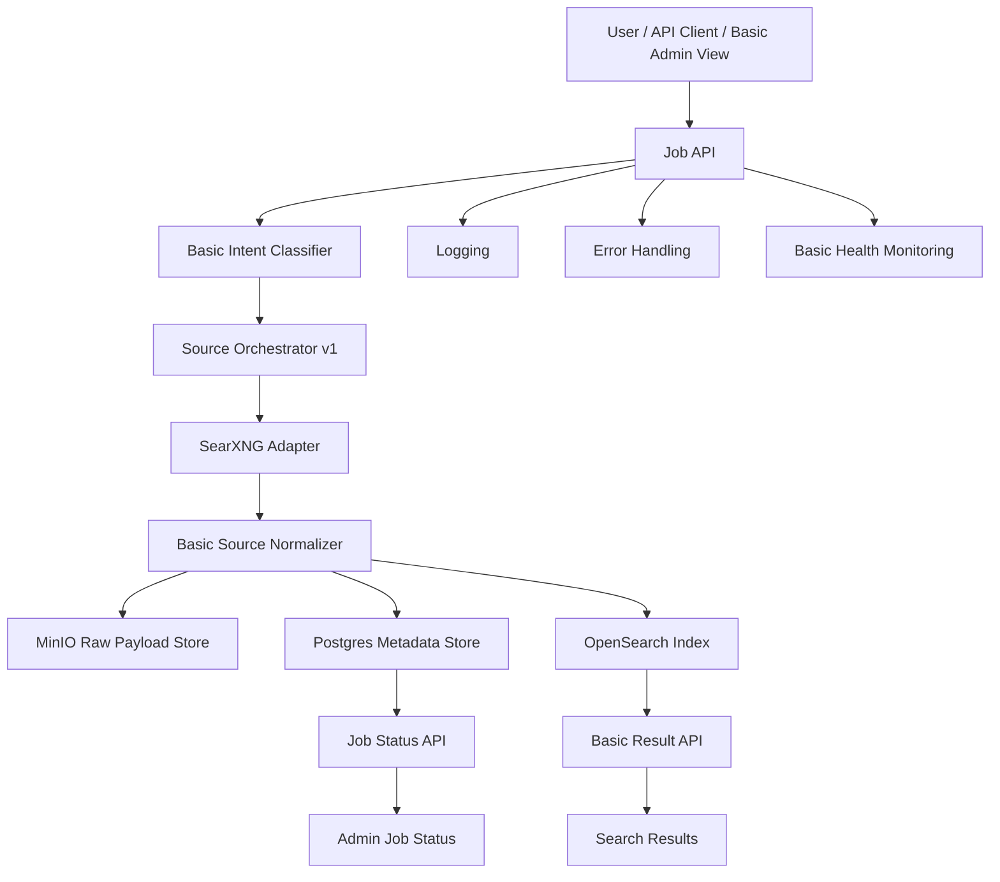

# CredenceAI Iteration 0.1 Architecture

## End Result

A working end-to-end MVP that can accept search jobs, fetch free-source results, normalize them, store them, index them, and return searchable output.

## Purpose

Prove the basic pipeline works from job submission to searchable result retrieval. This iteration is not about perfect intelligence. It is about creating a reliable skeleton that does not collapse when touched, a rare luxury in MVP land.

## Architecture Flow



## Scope

| Area | Included |
|---|---|
| Job API | Submit job, validate input, create trace ID, store status. |
| Intent classifier | Basic classification: search_query, entity_lookup, news_monitoring, research_collection. |
| Source orchestration | Free-first routing to SearXNG. |
| Adapter | SearXNG adapter only. |
| Normalization | Common result schema with title, URL, snippet, source, timestamp. |
| Storage | Raw payloads in MinIO, metadata in Postgres. |
| Indexing | Basic OpenSearch full-text indexing. |
| Serving | Result API and job status API. |
| Ops | Logging, error handling, health check. |

## Input Types

```json
{
  "job_type": "search_query",
  "input": "AI search intelligence platforms",
  "routing_mode": "free_first",
  "priority": "normal"
}
```

## Output Types

```json
{
  "query": "AI search intelligence platforms",
  "results": [
    {
      "title": "Example Result",
      "url": "https://example.com",
      "source": "searxng",
      "snippet": "...",
      "fetched_at": "2026-06-16T00:00:00Z"
    }
  ]
}
```

## End-State Components

| Component | Expected behavior |
|---|---|
| Job API | Creates and tracks jobs. |
| Basic Intent Classifier | Assigns simple intent labels. |
| Source Orchestrator v1 | Routes to SearXNG by default. |
| SearXNG Adapter | Fetches free search results. |
| Basic Normalizer | Produces common schema. |
| MinIO | Stores raw responses. |
| Postgres | Stores jobs, sources, and result metadata. |
| OpenSearch | Stores searchable normalized results. |
| Basic Result API | Retrieves indexed results. |
| Admin View | Shows job state and basic errors. |

## End Result Must Have

- Query submission through Job API.
- Basic intent classification.
- Free-first search via SearXNG.
- Normalized result schema.
- Raw payload storage in MinIO.
- Metadata storage in Postgres.
- Searchable indexing in OpenSearch.
- Result retrieval through API.
- Basic admin visibility for job status.

## Acceptance Criteria

- 100 test queries run end-to-end.
- At least 90% of source responses normalize successfully.
- Raw payloads are stored for audit.
- Results are searchable through API.
- Failed jobs are visible with error reason.
- System has a health check endpoint.

## Metrics

- Job success rate.
- Normalization success rate.
- Source response latency.
- Indexing success rate.
- API p50 and p95 response time.
- Failed job count.

## Explicitly Out of Scope

- AI agents.
- Playwright.
- Nutch.
- Heritrix.
- Paid SERP APIs.
- Advanced entity graph.
- Complex dashboards.
