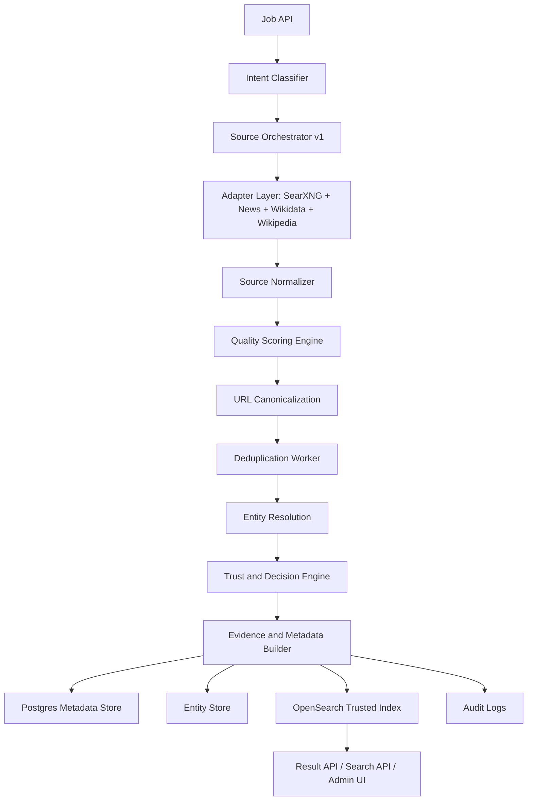

# CredenceAI Iteration 0.2 Architecture

## End Result

Quality-scored, deduplicated, entity-resolved, trusted search intelligence.

## Purpose

Improve accuracy and trust. Iteration 0.1 gives results. Iteration 0.2 decides which results are useful enough to keep, group, link, or reject.

## Architecture Flow



## Scope

| Area | Included |
|---|---|
| Source expansion | Add Wikidata and Wikipedia. Add news adapter if available. |
| Quality | Score relevance, source reliability, freshness, authority, and composite quality. |
| Deduplication | Canonical URL, tracking parameter removal, duplicate groups. |
| Entity resolution | Resolve basic organization/person/place entities. |
| Trust decision | Accept, review, or reject. |
| Provenance | Attach source, timestamp, score, and decision reason. |
| Cache | Query and entity candidate cache. |

## Input Types

```json
{
  "job_type": "entity_lookup",
  "input": "Tesla safety news",
  "requires_entity_resolution": true,
  "minimum_quality_score": 0.70
}
```

## Output Types

```json
{
  "canonical_entity": {
    "name": "Tesla Inc.",
    "type": "organization",
    "confidence": 0.91
  },
  "results": [
    {
      "title": "Tesla safety recall update",
      "url": "https://example.com/article",
      "quality_score": 0.84,
      "entity_match_score": 0.89,
      "duplicate_group_id": "dup_123",
      "decision": "accept"
    }
  ]
}
```

## End-State Components

| Component | Expected behavior |
|---|---|
| Quality Scoring Engine | Produces component scores and composite score. |
| URL Canonicalizer | Removes tracking parameters and normalizes URL form. |
| Dedup Worker | Groups exact and near duplicates. |
| Wikidata/Wikipedia Adapters | Provide entity identity and context. |
| Entity Resolver | Links results to canonical entities with confidence. |
| Trust Engine | Applies thresholds and final decision. |
| Evidence Builder | Captures provenance and decision metadata. |

## End Result Must Have

- Results are quality scored.
- Duplicates are removed or grouped.
- Entities are resolved with confidence.
- Sources have reliability scores.
- Every result has Accept, Review, or Reject decision.
- Evidence and provenance are attached.
- Trusted data is indexed and searchable.

## Acceptance Criteria

- At least 80% obvious duplicate suppression on labeled test data.
- At least 75% correct entity linking on basic test set.
- Every indexed result has quality score and decision.
- Duplicate groups are visible in API output.
- Source reliability is stored per source.
- Rejected results are not included in trusted index.

## Metrics

- Duplicate rate.
- Entity resolution accuracy.
- Accepted result ratio.
- Manual review rate.
- Average quality score.
- Source reliability distribution.

## Explicitly Out of Scope

- Deep crawling.
- Playwright fallback.
- Full evidence graph.
- AI critic agents.
- Benchmark automation beyond basic labeled tests.
