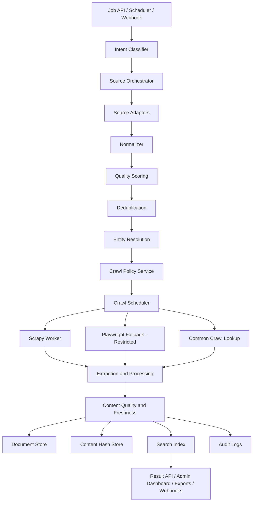

# CredenceAI Iteration 0.3 Architecture

## End Result

Safe crawling, content extraction, freshness scoring, and indexed trusted documents.

## Purpose

Improve coverage and content depth. Iteration 0.3 moves beyond snippets into full document collection while preserving crawl safety and policy compliance.

## Architecture Flow



## Scope

| Area | Included |
|---|---|
| Crawl policy | robots.txt, domain rate limit, private IP/SSRF, MIME, file size. |
| Crawler | Scrapy static crawler. |
| JS fallback | Playwright restricted to high-value static-failed pages. |
| Common Crawl | Used before live crawl for low-freshness jobs. |
| Extraction | Title, main text, metadata, language, links, content hash. |
| Freshness | Last seen, first seen, content hash comparison, freshness score. |
| Storage | Document store, content hash store, crawl cache. |
| Admin | Crawl status and extraction status visibility. |

## Input Types

```json
{
  "job_type": "url_crawl",
  "input": "https://example.com/research/article",
  "crawl_depth": 1,
  "freshness_required": "medium",
  "enable_extraction": true
}
```

## Output Types

```json
{
  "url": "https://example.com/research/article",
  "crawl_policy": {
    "robots_allowed": true,
    "rate_limit_ok": true,
    "risk_score": 0.08,
    "decision": "allowed"
  },
  "extraction": {
    "title": "Example Research Article",
    "main_text_length": 8420,
    "language": "en",
    "content_hash": "abc123",
    "extraction_quality_score": 0.87
  },
  "indexing_decision": "index"
}
```

## End-State Components

| Component | Expected behavior |
|---|---|
| Crawl Policy Service | Makes deterministic allow/deny decisions. |
| Crawl Scheduler | Prioritizes URLs and manages retries/backoff. |
| Scrapy Worker | Crawls static pages. |
| Playwright Worker | Used only for restricted JS fallback. |
| Common Crawl Adapter | Avoids live crawl when historical content is enough. |
| Extraction Processor | Produces readable content and metadata. |
| Freshness Scorer | Determines recency and change state. |
| Content Hash Store | Prevents duplicate work and detects changes. |

## End Result Must Have

- Policy-verified crawling.
- robots.txt respected.
- Rate limits enforced.
- Content extracted and cleaned.
- Extraction quality scored.
- Freshness and change detection available.
- Common Crawl integrated.
- Duplicate crawling minimized.
- Trusted documents indexed and searchable.
- Full audit trail for crawling decisions.

## Acceptance Criteria

- At least 70% crawl success for accessible static pages.
- 100% crawl attempts pass through policy service.
- Zero private IP crawls allowed.
- At least 80% extraction success on static pages.
- Every crawled document has content hash.
- Common Crawl is used for low-freshness jobs when available.

## Metrics

- Crawl success rate.
- Robots block rate.
- Extraction success rate.
- Average extraction quality.
- Freshness score distribution.
- Live crawl avoidance rate.
- Playwright usage ratio.

## Explicitly Out of Scope

- Large-domain Nutch crawling.
- Heritrix archival WARC crawls.
- Full multimedia extraction.
- Autonomous crawling without policy gates.
