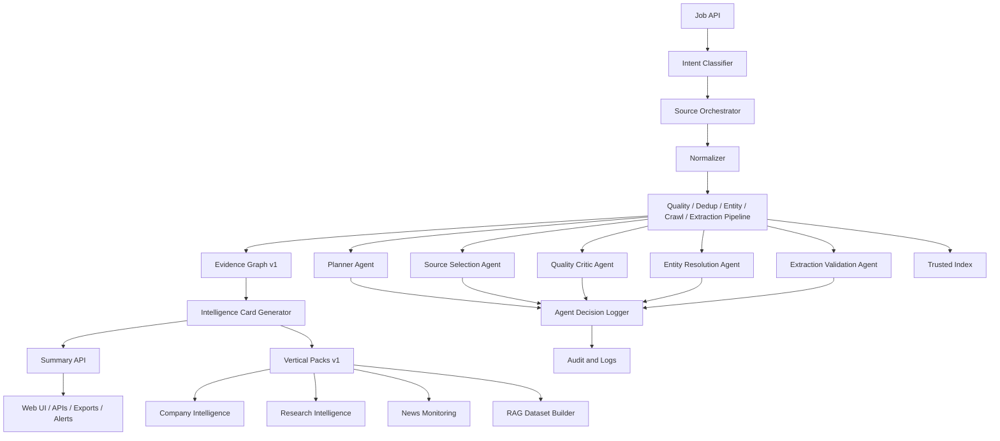

# CredenceAI Iteration 0.4 Architecture

## End Result

Agentic validation, evidence-backed intelligence outputs, and vertical intelligence packs.

## Purpose

Improve usefulness and decision quality. AI is introduced selectively for ambiguous, high-value, and synthesis-heavy cases, not as a decorative tax on every request.

## Architecture Flow



## Scope

| Area | Included |
|---|---|
| Agents | Planner, source selection, quality critic, entity resolution, extraction validation. |
| Agent governance | Agents cannot bypass policy or trust gates. |
| Evidence graph | Claims, evidence URLs, source links, entity relationships, provenance. |
| Intelligence cards | Entity/company/research/news cards. |
| Summary API | Evidence-backed synthesis with citations and confidence. |
| Vertical packs | Company intelligence, research intelligence, news monitoring, RAG dataset builder. |
| Logging | Every AI-assisted decision is logged. |

## Input Types

```json
{
  "job_type": "competitor_monitoring",
  "input": "Perplexity AI",
  "vertical": "company_intelligence",
  "enable_ai_validation": true,
  "output_mode": "intelligence_card"
}
```

## Output Types

```json
{
  "entity": {
    "name": "Perplexity AI",
    "type": "company",
    "confidence": 0.92
  },
  "intelligence_card": {
    "summary": "...",
    "recent_news": [],
    "official_sources": [],
    "related_entities": [],
    "risk_signals": [],
    "source_confidence": 0.84
  },
  "agent_decisions": [
    {
      "agent": "quality_critic",
      "decision": "accept",
      "reason": "High relevance, trusted source, recent document",
      "confidence": 0.88
    }
  ]
}
```

## End-State Components

| Component | Expected behavior |
|---|---|
| Planner Agent | Decomposes goals into executable jobs. |
| Source Selection Agent | Recommends source mix and fallback strategy. |
| Quality Critic Agent | Reviews borderline and high-value results. |
| Entity Resolution Agent | Resolves ambiguous entity cases. |
| Extraction Validation Agent | Detects CAPTCHA, login pages, boilerplate, soft 404s, wrong language. |
| Evidence Graph | Stores claims, sources, entities, and provenance. |
| Intelligence Card Generator | Produces structured cards for vertical use cases. |
| Summary API | Produces evidence-backed synthesis. |

## End Result Must Have

- Policy-verified crawling retained.
- Results are quality scored and deduplicated.
- Entities resolved with confidence.
- AI validates ambiguous or high-value cases.
- Agent decisions are logged and explainable.
- Evidence graph is attached to results.
- Intelligence cards are generated.
- Evidence-backed summaries are available.
- Vertical intelligence packs are usable end-to-end.
- Trusted data remains indexed and searchable.

## Acceptance Criteria

- Agent decisions logged for 100% AI-assisted cases.
- AI cannot bypass crawl policy.
- At least 85% extraction validation accuracy on labeled test set.
- Intelligence cards generated for selected entities.
- Evidence attached to summaries.
- At least two vertical packs usable end-to-end.

## Metrics

- Summary faithfulness.
- Agent decision accuracy.
- Entity ambiguity resolution rate.
- Evidence coverage.
- Intelligence card completion rate.
- User review acceptance rate.

## Explicitly Out of Scope

- Fully autonomous agents.
- AI safety policy decisions.
- Unbounded LLM calls.
- Automated high-stakes decisions without human review.
