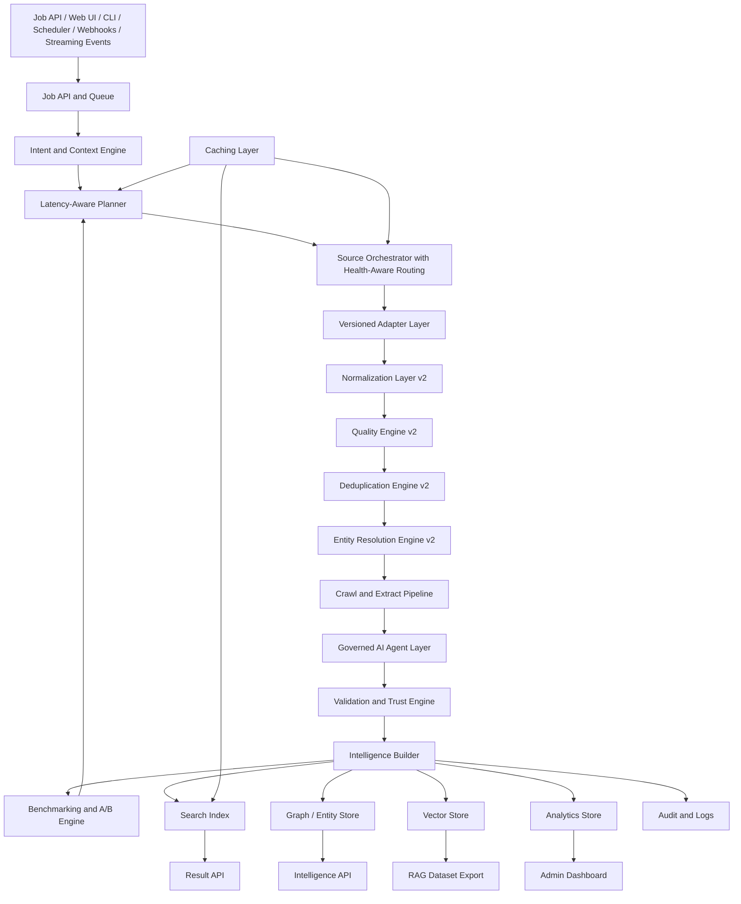

# CredenceAI Iteration 0.5 Architecture

## End Result

Production-ready, scalable, optimized, self-improving search intelligence platform.

## Purpose

Improve speed, efficiency, reliability, observability, scale, and measurable product quality. The system becomes production-grade instead of merely impressive in diagrams, where many software projects retire undefeated.

## Architecture Flow



## Scope

| Area | Included |
|---|---|
| Execution modes | Fast, Standard, Deep. |
| Latency planner | Deadline-aware routing and source selection. |
| Hybrid retrieval | BM25 + vector + metadata + entity filters + reranking. |
| Caching | Query, entity, URL canonical, robots, embedding, result cache. |
| Benchmarking | Benchmark runner, labeled datasets, quality reports. |
| A/B testing | Traffic splitting, metrics collection, winner selection. |
| Observability | SLOs, metrics, logs, traces, dashboards, alerts. |
| Scale | Worker scaling, queue isolation, provider health routing. |
| Security | Enterprise RBAC, PII redaction, audit logging, network controls. |
| Cost | Quotas, budget manager, provider cost tracking. |

## Input Types

```json
{
  "job_type": "research_collection",
  "input": "AI-powered enterprise search platforms",
  "execution_mode": "deep",
  "benchmark_enabled": true,
  "max_sources": 5,
  "max_urls_to_crawl": 30,
  "max_llm_calls": 8
}
```

## Output Types

```json
{
  "job_id": "job_789",
  "status": "completed",
  "execution_mode": "deep",
  "quality_summary": {
    "accepted": 42,
    "rejected": 18,
    "manual_review": 5
  },
  "performance": {
    "p95_latency_ms": 14500,
    "cache_hit_rate": 0.41,
    "crawl_avoidance_rate": 0.33
  },
  "benchmark": {
    "top_10_precision": 0.82,
    "duplicate_rate": 0.11,
    "extraction_success_rate": 0.78
  }
}
```

## End-State Components

| Component | Expected behavior |
|---|---|
| Latency-Aware Planner | Selects Fast, Standard, or Deep strategy. |
| Hybrid Retrieval | Combines lexical, semantic, metadata, and entity ranking. |
| Advanced Caching | Reduces duplicate source calls, crawls, and embeddings. |
| Benchmark Engine | Runs labeled evaluation sets. |
| A/B Engine | Tests source, scoring, crawl, and agent changes. |
| Provider Health Router | Avoids degraded sources. |
| Cost and Quota Manager | Enforces per-job and per-tenant budgets. |
| Admin Dashboard | Shows ops, quality, cost, provider health, and review state. |
| Security Layer | Supports RBAC, audit, PII protection, network controls. |

## End Result Must Have

- Sub-3 second Fast Mode responses.
- High accuracy and deduplication.
- Safe, policy-compliant crawling.
- Evidence-backed intelligence.
- RAG-ready datasets.
- Auto-optimized for cost and latency.
- A/B tested and benchmarked improvements.
- Full observability and alerting.
- Enterprise-ready security.
- Scalable, reliable, self-improving operations.

## Acceptance Criteria

- Fast mode responds in 1 to 3 seconds for cached/indexed queries.
- Standard mode responds in 5 to 20 seconds for source-backed queries.
- Deep mode supports longer research jobs.
- At least 30% reduction in unnecessary live crawls.
- At least 25% reduction in repeated source calls through caching.
- A/B test framework operational.
- Provider health dashboard operational.
- DLQ dashboard operational.
- Admin review queue operational.

## Metrics

- p50, p95, and p99 response times.
- Cache hit rate.
- Source call reduction.
- Crawl avoidance rate.
- Top-10 precision.
- Duplicate rate.
- Entity resolution accuracy.
- Cost per query.
- Manual review rate.
- Provider health score.

## Explicitly Out of Scope

- Unlimited autonomous web crawling.
- Use of paid providers without benchmark justification.
- Unbounded browser rendering.
- Human-impacting automated decisions without review and domain governance.
