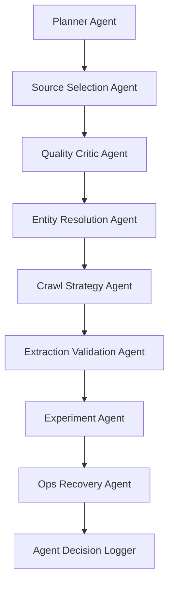

# Agentic AI Layer

## Principle

AI agents are internal assistants, not uncontrolled autonomous actors. Agents can recommend, score, validate, critique, summarize, and prioritize. They must not bypass policy, compliance, or storage rules.

## Agent Architecture



## Agents

### Planner Agent

Breaks a user/system goal into executable jobs.

Functions:

```text
decompose_goal()
identify_entities()
select_verticals()
define_success_metrics()
create_job_plan()
```

### Source Selection Agent

Recommends the best source mix for each job.

| Job | Recommendation |
|---|---|
| Scholarly search | OpenAlex + Crossref + arXiv |
| Breaking news | GDELT + SearXNG news |
| Entity lookup | Wikidata + Wikipedia |
| Historical page | Common Crawl + Internet Archive |

### Quality Critic Agent

Critiques borderline results before crawling or indexing.

Questions:

- Is this relevant?
- Is this fresh enough?
- Is this source reliable?
- Is this duplicate?
- Is the entity match correct?
- Is the result worth crawling?

### Entity Resolution Agent

Handles ambiguous and complex entity matching.

Example:

```text
Apple releases new model
→ Apple Inc. if context includes iPhone, Mac, Cupertino
→ apple fruit if context includes farming, fruit, harvest
→ Apple Records if context includes Beatles, music label
```

### Crawl Strategy Agent

Chooses the cheapest safe crawl strategy:

- skip.
- metadata only.
- Scrapy crawl.
- Playwright crawl.
- Common Crawl lookup.
- Internet Archive lookup.

### Extraction Validation Agent

Detects:

- Empty extraction.
- Boilerplate-only extraction.
- Wrong language.
- CAPTCHA pages.
- Login pages.
- Soft 404.
- Paywall pages.
- Truncated content.

### Experiment Agent

Recommends what to test, metrics to track, and when to stop an experiment.

### Ops Recovery Agent

Detects provider degradation, Kafka lag, crawler failure spikes, indexing delays, storage errors, and DLQ growth.

## Agent Decision Contract

```json
{
  "agent_name": "quality_critic",
  "job_id": "job_123",
  "input_ref": "res_456",
  "decision": "crawl",
  "reason": "High relevance, trusted source, fresh result, not duplicate",
  "confidence": 0.87,
  "created_at": "2026-06-16T00:00:00Z"
}
```

## Agent Use Policy

| Situation | Use AI agent? |
|---|---|
| Obvious duplicate | No |
| High-confidence source result | No |
| Low-quality spam result | No |
| Ambiguous entity | Yes |
| Conflicting source metadata | Yes |
| Borderline trust score | Yes |
| Final user-facing summary | Yes |
| Crawl policy decision | No, deterministic only |

## Non-Negotiable Guardrails

- AI cannot override robots.txt.
- AI cannot bypass SSRF protection.
- AI cannot change MIME validation results.
- AI cannot index rejected unsafe payloads.
- AI decisions must be logged.
- AI should be budgeted per job.
