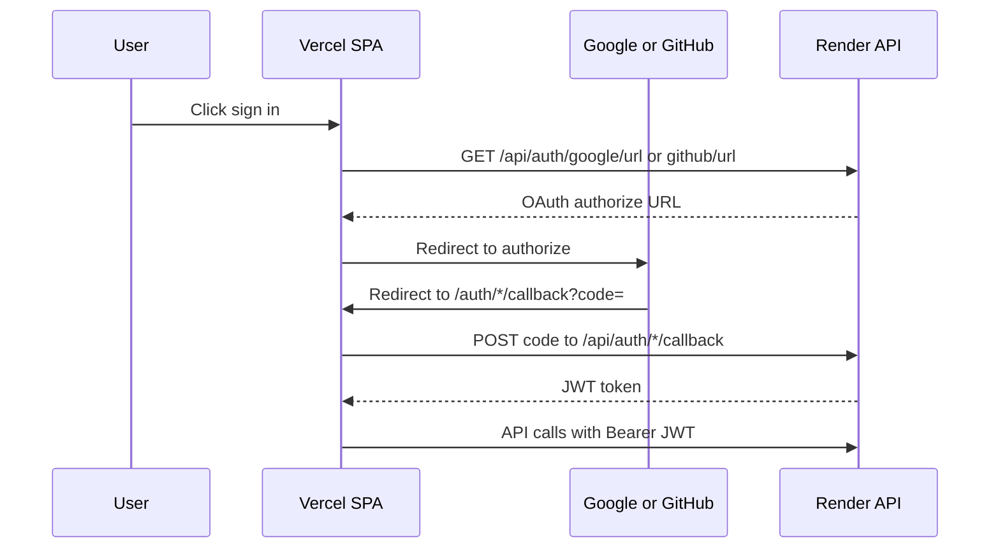

# OAuth Setup (Google + GitHub)

> **Complete deploy checklist (start here):** [manual-setup.md](manual-setup.md)

Use this document for OAuth-specific configuration and troubleshooting after the frontend (Vercel) and API (Render) are deployed.

Replace placeholders with your real URLs:

```
FRONTEND_URL=https://your-app.vercel.app
API_URL=https://your-api.onrender.com
```

The OAuth **redirect URI** always points to the **frontend** callback route (`/auth/google/callback` or `/auth/github/callback`). The browser receives the authorization code; the frontend exchanges it with the API using `VITE_API_BASE_URL`.

---

## How auth works in production



With `ENABLE_API_KEY_AUTH=true`:

- **Web UI** uses `Authorization: Bearer <JWT>` after OAuth.
- **Scripts / SDK** use `X-API-Key: cred_sk_...` from Settings.

---

## Google OAuth

### 1. Google Cloud Console

1. Open [Google Cloud Console](https://console.cloud.google.com/) → **APIs & Services** → **Credentials**.
2. **Create Credentials** → **OAuth 2.0 Client ID** → type **Web application**.
3. **Authorized JavaScript origins** (no trailing slash):
   - `FRONTEND_URL`
   - Any Vercel alias users open (e.g. `https://your-app-alias.vercel.app`)
   - `http://localhost:3000` (local dev, optional)
4. **Authorized redirect URIs** (must match **exactly**):
   - `FRONTEND_URL/auth/google/callback`
   - `FRONTEND_ALIAS/auth/google/callback` (if using alias)
   - `http://localhost:3000/auth/google/callback` (optional)
5. Copy **Client ID** and **Client Secret**.

### 2. OAuth consent screen

1. **APIs & Services** → **OAuth consent screen**
2. User type: **External** (public) or **Internal** (Google Workspace)
3. Scopes: `openid`, `email`, `profile`
4. While in **Testing** mode, add test users under **Test users**
5. **Publish app** when ready for public sign-in

### 3. Render environment variables

```env
GOOGLE_CLIENT_ID=<from Google Console>
GOOGLE_CLIENT_SECRET=<from Google Console>
GOOGLE_REDIRECT_URI=FRONTEND_URL/auth/google/callback
```

These may be set in the Render dashboard (`sync: false`) or pinned in [`render.yaml`](../render.yaml) for blueprint sync. After changes, **redeploy** the API.

### 4. Verify

```bash
curl API_URL/api/auth/google/url
# Expect: "mock": false
```

Browser:

1. Open `FRONTEND_URL/auth/sign-in` → **Google**
2. Complete Google login → `/auth/google/callback`
3. Land on `/app/dashboard`

| Error | Fix |
|-------|-----|
| `redirect_uri_mismatch` | Redirect URI in Google Console must exactly match `GOOGLE_REDIRECT_URI` |
| `503 Google OAuth not configured` | Set all three `GOOGLE_*` vars on Render and redeploy |
| `access_denied` / app not verified | Add test users or publish consent screen |
| CORS error | `CORS_ALLOWED_ORIGINS` must include every frontend origin (no trailing slash) |
| Sign-in works but dashboard fails | API needs latest JWT middleware; redeploy from `master` |

---

## GitHub OAuth

### 1. GitHub OAuth App

1. GitHub → **Settings** → **Developer settings** → **OAuth Apps** → **New OAuth App**
2. **Application name:** CredenceAI
3. **Homepage URL:** `FRONTEND_URL`
4. **Authorization callback URL:** `FRONTEND_URL/auth/github/callback`

> GitHub allows **one** callback URL per OAuth app. Use your canonical `FRONTEND_URL`. For local dev, create a second OAuth app with `http://localhost:3000/auth/github/callback`.

5. Copy **Client ID**; generate a **Client Secret**

### 2. Render environment variables

```env
GITHUB_CLIENT_ID=<from GitHub>
GITHUB_CLIENT_SECRET=<from GitHub>
GITHUB_REDIRECT_URI=FRONTEND_URL/auth/github/callback
```

May be dashboard-only or blueprint-pinned in [`render.yaml`](../render.yaml). Redeploy after changes.

### 3. Verify

```bash
curl API_URL/api/auth/github/url
# Expect: "mock": false and redirect_uri=FRONTEND_URL/auth/github/callback
```

Browser:

1. Open `FRONTEND_URL/auth/sign-in` → **GitHub**
2. Authorize on GitHub → `/auth/github/callback`
3. Land on `/app/dashboard`

| Error | Fix |
|-------|-----|
| Redirect URI not associated | Callback URL in GitHub app must match `GITHUB_REDIRECT_URI` |
| `incorrect_client_credentials` | Regenerate client secret; update Render |
| Missing email | Grant `user:email` scope; set primary email on GitHub |
| `X-API-Key header is required` | Redeploy API from latest `master` |

---

## Production requirements

| Variable | Required |
|----------|----------|
| `APP_ENV` | `production` |
| `JWT_SECRET` | Strong random (`openssl rand -hex 32`) |
| OAuth | At least one of Google or GitHub fully configured |
| `CORS_ALLOWED_ORIGINS` | JSON array of all frontend origins |
| `ENABLE_API_KEY_AUTH` | `true` |

**Vercel:**

```env
VITE_API_BASE_URL=API_URL/api
```

Must redeploy frontend after changing this variable.

---

## API key flow (after OAuth)

1. Sign in with Google or GitHub
2. Go to **Settings** → **Create API Key**
3. Copy `cred_sk_...` (shown once)
4. Use programmatically:

```bash
curl -X POST API_URL/api/jobs \
  -H "X-API-Key: cred_sk_YOUR_KEY" \
  -H "Content-Type: application/json" \
  -d '{"job_type":"search_query","query":"test","input":"test"}'

curl API_URL/api/auth/validate -H "X-API-Key: cred_sk_YOUR_KEY"
```

---

## Custom domain

When you add a domain:

1. Point `app.yourdomain.com` → Vercel, `api.yourdomain.com` → Render
2. Update authorized origins and redirect URIs in **Google Console** and **GitHub OAuth App**
3. Update on Render: `GOOGLE_REDIRECT_URI`, `GITHUB_REDIRECT_URI`, `CORS_ALLOWED_ORIGINS`
4. Update on Vercel: `VITE_API_BASE_URL=https://api.yourdomain.com/api`
5. Redeploy frontend and API; sync Render blueprint

---

## Security

If OAuth secrets were exposed, rotate immediately:

- **Google:** GCP Credentials → reset client secret → update Render
- **GitHub:** OAuth App → regenerate client secret → update Render

Never commit secrets. See [manual-setup.md#security-rotation-after-exposure](manual-setup.md#security-rotation-after-exposure).
